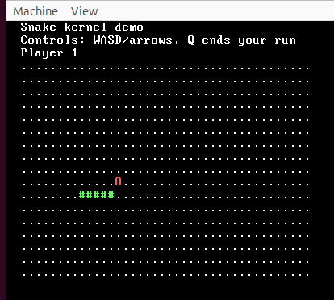

# PeachOS-Game

A tiny 32-bit hobby OS kernel (C/ASM for i686) that boots into a VGA text terminal with a minimal shell and a multi-player snake demo (1–4 players, WASD/arrows).

## Why it’s interesting
- Boots a FAT16 image with custom boot sector + kernel.
- Real low-level drivers: PS/2 keyboard IRQ handler (maps arrows), PIT timer at 60 Hz, VGA text output.
- Basic kernel subsystems: GDT/IDT, paging, heap, filesystem layer, TSS.
- Tiny shell and a multi-player snake game rendered in VGA text mode with wraparound and scoring.

## Prerequisites
- `nasm`, `make`, `sudo` (Makefile mounts the image at `/mnt/d`)
- Cross toolchain: `i686-elf-gcc`, `i686-elf-ld` in `PATH` (build.sh expects `$HOME/opt/cross/bin`)
- Optional: `qemu-system-i386` to run the image

## Build
```bash
./build.sh        # export PATH to your cross toolchain and run make all
# or
make all
```
Outputs (`bin/`):
- `boot.bin`  boot sector
- `kernel.bin`  kernel binary
- `os.bin`  16MB FAT16 disk image (boot + kernel + padding + copied hello.txt)

## Run in QEMU
```bash
qemu-system-i386 -hda bin/os.bin          # fullscreen window
# or for a serial console view:
qemu-system-i386 -drive format=raw,file=bin/os.bin -serial stdio
```

## Using the shell
- Type `snake` to launch the snake demo; pick 1–4 players. Controls: WASD or arrows, `q` to end your run. The game wraps at the edges and shows a score table after all runs.
- Other commands: `clear`, `help`, `quit`

## Screenshot
<p align="center">
  
  <br>
  <em>Snake demo results after a two-player run (WASD/arrows, wraparound grid).</em>
</p>

## Clean
```bash
make clean
```

## Layout
- `src/` – kernel sources (boot, GDT/IDT, paging, heap, filesystem, tasks, keyboard, timer, screen)
- `programs/blank/` – sample user program
- `build/` – object files
- `bin/` – boot sector, kernel, and final disk image
